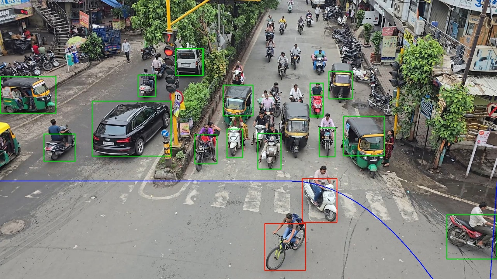

# Traffic Signal Violation Detection

*Automate traffic signal violation detection with real-time machine learning and computer vision.*

[](https://python.org)
[](https://www.tensorflow.org)
[](https://github.com/ultralytics/yolov5)

---

## 🌟 Live Demo
Run locally: [http://127.0.0.1:5000](http://127.0.0.1:5000) (after setup)

---

## 📋 Table of Contents

- [Overview](#overview)
- [Why Traffic Signal Violation Detection?](#why-traffic-signal-violation-detection)
- [Getting Started](#getting-started)
  - [Prerequisites](#prerequisites)
  - [Installation](#installation)
  - [Usage](#usage)
- [Screenshots](#screenshots)
- [Contributors](#contributors)
- [License](#license)

---

## Overview

Traffic Signal Violation Detection is a machine learning-powered system that uses the YOLOv5 framework for real-time detection of vehicles violating traffic signals. Integrated with license plate recognition and a web interface, it automates violation tracking and provides actionable insights through a user-friendly dashboard.

---

## Why Traffic Signal Violation Detection?

This project enhances road safety and traffic management with the following features:

### 🚗 **Real-Time Vehicle Detection**
Utilizes YOLOv5 for fast and accurate detection of vehicles and traffic signals.

### 📸 **License Plate Recognition**
Employs Tesseract OCR to identify violating vehicles and automate fine issuance.

### 🌐 **Web-Based Monitoring**
Offers a Flask-based web interface for real-time violation monitoring.

### 📊 **Insightful Dashboard**
Visualizes traffic violation trends and system performance metrics.

### 🛠️ **Scalable Data Pipeline**
Includes robust data collection and preprocessing for reliable model training.

---

## Getting Started

### Prerequisites

- **Programming Language**: Python 3.8+
- **Package Manager**: pip
- **Dependencies**: Listed in `requirements.txt`
- **Hardware**: Webcam or traffic camera feed for real-time detection (optional)

### Installation

1. **Clone the repository:**
   ```bash
   git clone https://github.com/tirth013/Automatic-Traffic-Violation-Detection.git
   cd Automatic-Traffic-Violation-Detection
   ```

2. **Install dependencies:**
   ```bash
   pip install -r requirements.txt
   ```

3. **Run the Flask application:**
   ```bash
   python main.py
   ```

4. **Access the app:**
   Open your browser and navigate to `http://127.0.0.1:5000`.

### Usage

1. **Set up input source**:
   Configure the system to use traffic camera feeds or pre-recorded videos.
2. **Run the application**:
   Start the Flask app to launch the web interface.
3. **Monitor violations**:
   Use the dashboard to view real-time detections, license plate data, and violation trends.

---

## 🚀 Features

- 🧠 YOLOv5-based real-time vehicle and traffic signal detection
- 📄 License plate recognition with Tesseract OCR
- 🌐 Responsive web interface built with HTML, CSS, JavaScript, and Flask
- 📊 Interactive dashboard for violation trends and system performance
- ⚡ Automated fine issuance for detected violations

---

## Screenshot



---

## Contributors

- **Tirth Asodariya**  
  - [LinkedIn](https://www.linkedin.com/in/tirth-asodariya111/)  
  - [GitHub](https://github.com/tirth013)

- **Aryan D. Jadav**  
  - [LinkedIn](https://www.linkedin.com/in/aryan-jadav-a37j/)  
  - [GitHub](https://github.com/aryanjadav037)

- **Manan Gajera**  
  - [LinkedIn](https://www.linkedin.com/in/manan-gajera-007379238/)

- **Aditya Bhakhar**  
  - [LinkedIn](https://www.linkedin.com/in/aditya-bhakhar-5932b0301/)  
  - [GitHub](https://github.com/adityabhakhar10)

- **Kaushal Gadhiya**  
  - [LinkedIn](https://www.linkedin.com/in/kaushal-gadhiya-57266319a/)


---

## License

This project is licensed under the MIT License. See the [LICENSE](LICENSE) file for details.

---

**[↑ Return to top](#traffic-signal-violation-detection)**
